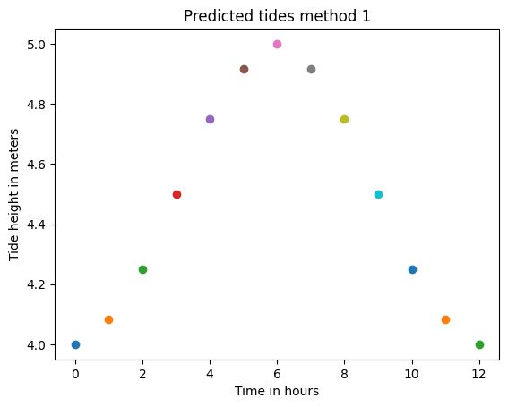
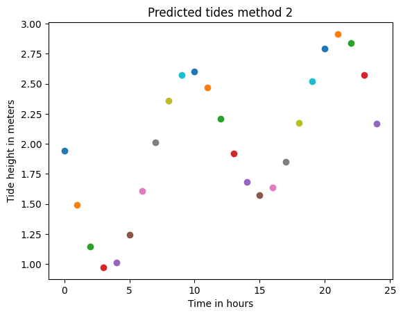
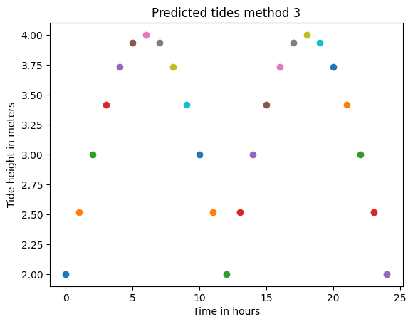
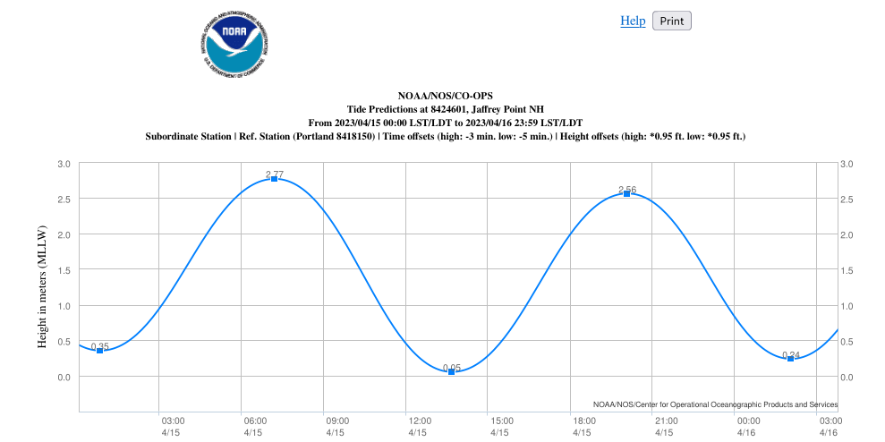
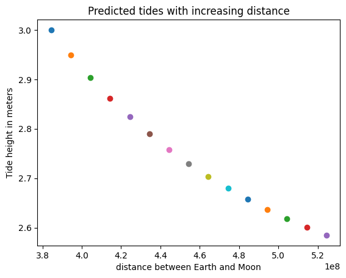
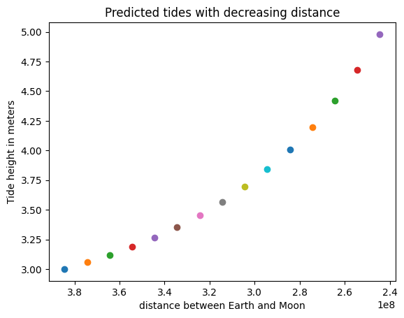

# LES MARÉES

Dans le cadre d'ARE DYNAMIC, nous aspirons à créer un modèle dynamique des marées, capable de prédire leurs fluctuations en prenant en compte les différents facteurs influençant ce processus naturel.

## English version

For our class "ARE DYNAMIC," we aspire  to create a dynamic tidal model capable of predicting tidal fluctuations while incorporating the complex factors that influence this natural process. 

## Présentation de l'équipe

|Ayham|Iman|Hadil|Sam|Suleiman|
|---|---|---|---|---|

## Description synthétique du projet

**Problématique :** L'habitabilité potentielle d'une planète peut-elle être déduite en analysant la dynamique des marées résultant des forces gravitationnelles de sa (ses) lune(s) et du soleil ?

**Hypothèse principale :** On peut estimer l'amplitude des forces de marée exercées sur une planète en calculant les effets gravitationnels de sa ou ses lune(s) et du soleil, en fonction de leurs distances et masses respectives. Ces données peuvent fournir des informations sur des facteurs importants tels que l'activité géologique de la planète, la stabilité climatique et l'habitabilité potentielle.

**Hypothèses secondaires :** Le calcul des forces de marée peut être complexe et nécessite la prise en compte de divers paramètres planétaires et astronomiques, rendant ainsi la tâche impossible.

**Objectifs :** Développer un modèle dynamique qui estime approximativement la hauteur des marées à différents paramètres.

**Critère(s) d'évaluation :** La distance et la masse du Soleil et de la Lune. Le nombre de lunes.

## Présentation structurée des résultats

#### recherche de méthode
Pour notre modélisation nous avons d'abord cherché une méthode pour prédire les marées.

- **Méthode 1**
cette méthode utilise la [Rule of twelfths](https://en.wikipedia.org/wiki/Rule_of_twelfths#References)
C'est une méthode très simple avec peu de paramètres à modifier, nous ne l'avons donc pas utilisée. mais il est assez important pour avoir une idée générale sur la façon dont les marées augmentent.

- **Méthode 2**
cette méthode utilise les [Constituants harmoniques](https://tidesandcurrents.noaa.gov/about_harmonic_constituents.html)
Cette méthode est plus complexe et précise. mais les paramètres modifiables n'étaient pas ceux que nous recherchions. nous décidons donc de ne pas utiliser cette méthode également.

- **Méthode 3**
C'est notre méthode. (nous nous sommes inspirés des deux méthodes précédentes.) 
**explication** : 
On calcule d'abord la [force génératrice](https://oceanservice.noaa.gov/education/tutorial_tides/tides02_cause.html) de la marée,  
puis on calcule l'angle correspondant au temps donné en heures, pour cela on suppose qu'une journée complète équivaut à 2π radians. 
après on multiplie la somme des forces gravitationnelles du Soleil et de la Lune par la valeur absolue du sinus de l'angle temporel. 
Ce résultat est ensuite multiplié par la plage de marée donnée et divisé par un scalaire constant pour mettre le résultat à l'échelle de manière appropriée.  
Enfin, le niveau de marée initial est ajouté pour obtenir le niveau de marée prévu. 
Cette méthode est assez simplifiée et différente des processus physiques réels qui régissent les marées.  
Le calcul suppose que : 
la rotation et la révolution de la Terre autour du Soleil sont circulaires. 
l'orbite de la Lune autour de la Terre est circulaire. 
il ne considère que les effets de la lune et du soleil sur les marées et écarte tous les autres facteurs. 

#### comparaison entres les méthodes

voici une comparaison entre les trois méthodes et une prédiction de la NOAA

  
  
  
  

Nous pouvons voir qu'il y a toujours un motif répétitif (similaire à une fonction sinusoïdale) même si les valeurs peuvent différer. 
Aussi nous pourrions ajouter une valeur aléatoire à notre méthode (méthode 3) pour la rendre plus réelle mais nous pensons que pour modéliser cela suffit. 
Alors en prenant la troisième méthode maintenant nous avons plusieurs paramètres : la masse du Soleil, la masse de la Lune, la distance entre la planète et la Lune, la Distance entre la planète et le soleil, l'heure, le marnage et la marée initiale. Nous pourrions également modifier la fonction pour ajouter plusieurs lunes.  
Voici un exemple de ce qui se passe si la distance entre la terre et la lune augmente ou diminue. Pour voir le code et toutes les comparaisons, consultez le notebook jupyter. 

  
  

#### conclusion 

La potentialité d'habitabilité d'une planète ne peut pas être déterminée uniquement en analysant la dynamique des marées car il existe des autres facteurs qui contribuent également à son habitabilité, tels que la distance de la planète par rapport au soleil, la composition atmosphérique, la température de surface, le champ magnétique et la présence d'eau liquide. 
Mais on pense que les forces de marée jouent un rôle important dans l'environnement d'une planète. Dans certains cas, des forces de marée fortes peuvent être bénéfiques pour l'habitabilité, car elles peuvent stimuler l'activité géologique et réguler le climat de la planète. Cependant, dans d'autres cas, des forces de marée excessives peuvent être préjudiciables à l'habitabilité en provoquant un chauffage extrême, un verrouillage des marées ou des processus géologiques destructeurs. 

Par conséquent, même si la prévision des marées est une tâche complexe nous croyons que l'analyse de la dynamique des marées peut fournir des informations sur le potentiel d'habitabilité d'une planète, mais elle doit être considérée en conjonction avec d'autres facteurs.

## Lien vers page de blog : <a href="blog.html"> C'est ici ! </a>
